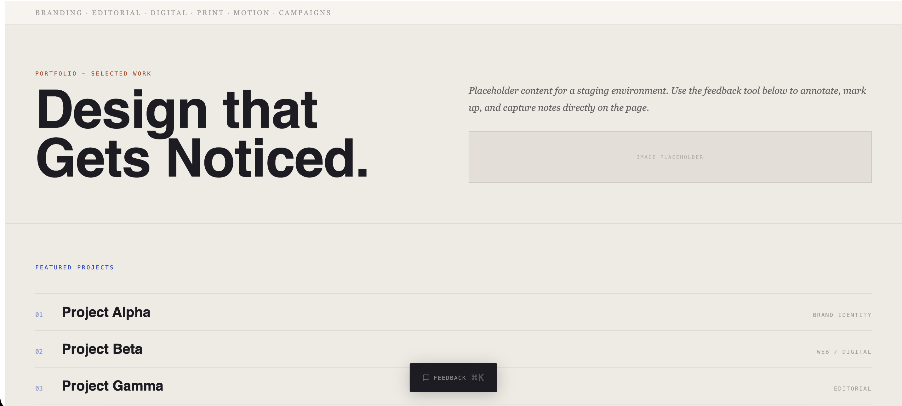
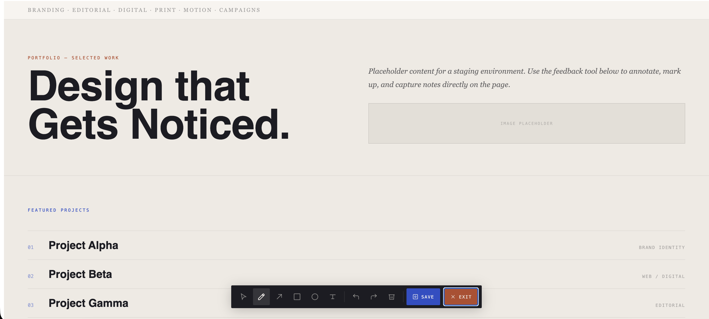
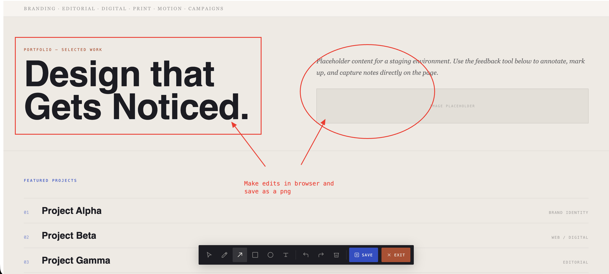

# feedback-overlay

A visual annotation overlay for React + Vite apps. Drop it into any staging environment so clients can draw, arrow, box, and type directly on the page, then save a merged screenshot.

## Preview

| Step 1 | Step 2 | Step 3 |
|---|---|---|
|  |  |  |

## Install

```bash
npm install github:Humberto-Zayas/feedback-overlay
```

## Usage

Import and render `FeedbackOverlay` somewhere near the root of your app (e.g. `App.jsx`):

```jsx
import { FeedbackOverlay } from 'feedback-overlay';

function App() {
  return (
    <>
      <FeedbackOverlay enabled={import.meta.env.DEV || import.meta.env.VITE_FEEDBACK_ENABLED === 'true'} />
      {/* rest of your app */}
    </>
  );
}
```

### Environment gating

| Environment | What to do | Result |
|---|---|---|
| Local dev | Nothing — `import.meta.env.DEV` is `true` automatically | Overlay shows |
| Staging (Railway, Vercel, etc.) | Set env var `VITE_FEEDBACK_ENABLED=true` in your service settings | Overlay shows |
| Production | Leave `VITE_FEEDBACK_ENABLED` unset | Overlay hidden |

> **Important:** Vite bakes env vars into the bundle at build time. Set `VITE_FEEDBACK_ENABLED=true` before running `npm run build` for your staging deployment, and leave it unset for your production build.

## Tools

| Tool | Description |
|---|---|
| Select | Click and move existing annotations |
| Draw | Freehand pen |
| Arrow | Click and drag to draw an arrow |
| Box | Click and drag to draw a rectangle |
| Circle | Click and drag to draw an ellipse |
| Text | Click anywhere to add editable text |
| Undo / Redo | Step through annotation history |
| Clear | Remove all annotations |
| Save | Merges your annotations onto a screenshot and downloads a PNG |

## Keyboard shortcuts

- `Cmd+K` / `Ctrl+K` — open feedback mode
- `Esc` — close feedback mode

## Peer dependencies

Your project must have `react` and `react-dom` installed (v17 or later).

## Try the demo

A working demo app is included in the `demo/` directory. It's a plain React + Vite app with the overlay already wired up — good for trying out the tools before integrating into your own project.

```bash
# 1. Install root deps (feedback-overlay itself)
npm install

# 2. Install and run the demo
cd demo
npm install
npm run dev
```

Then open `http://localhost:5173` in your browser. Press `Cmd+K` to open the feedback overlay and try the tools.

## Development (this repo)

```bash
# Install root deps
npm install

# Build the package
npm run build

# Run the demo against local source (no build needed — demo aliases src directly)
cd demo
npm install
npm run dev
```
